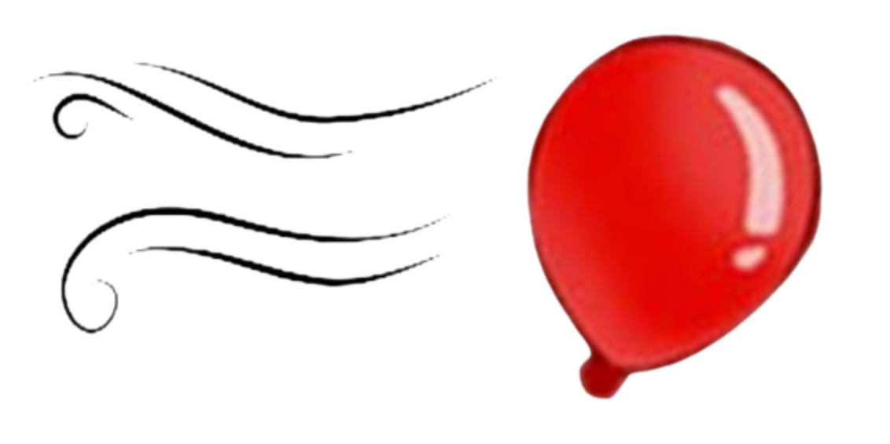

<h1 align="center">

All Luck
</h1>

### Adds modifiers to the game that can be enabled and disabled per-save.

* Good and bad modifiers
* All modifiers toggleable
* Green button to show modifiers in game mode selection screen
* Modifiers stack

